# レバーレス

Amazon で買った支那産レバーレス Fight Box。安いし良いです。今 Amazon を見たら、買ったときよりも値上げしてたけど。
ファームウェア更新で、繋いでるときに下の操作で⬆⬇同時入力時の設定を変えられる様になった。

* Mode + Start + Down = Neutral
* Mode + Start + Up = 上優先
* Mode + Start + Left = 前の優先

Mode ボタンというのは、XBox ボタン（背面右側→）

# レバーレスコントローラの入力

文章中の方向表記はテンキー方向、または矢印で表す。⬆➡⬇⬅↗↘↙↖
右向き前提。
左向き時は、4 と 6 を入れ替える。

## レバーレスの特徴

意図しない方向を通ってしまう事がなく、入力の正確性が高い。
レバーと比較すると反対方向への入力が速いので、前歩きから瞬時にガードに入れやすい。
 
反面、レバーの様な直感的な操作ができず、レバー操作時にはそれほど意識する必要がなかった「離す」操作も意識しておかないと、操作自体が覚束ない。
慣れるまでは現在の入力を見失ってしまう瞬間があり、立て直しの時間が発生したりする。

## 慣れ方

操作はワールドツアーで慣れるのが良い。
コマンド入力の練習に特化したければ、トレモやコンボチャレンジが良いと思う。

## 脱力

レバーレスを使い始めると、変に力が入ってすぐに疲れたり、指に痛みを覚えたりする事がある。
力を入れすぎると、疲れやすかったり、次の行動が遅れたりするし、いい結果は生まないので、力まないことは大事。

とはいえ、最初から脱力しようなんて考えていては上達が遅れます。

最初は力んでもいい。疲れを覚えたら手を休めよう。 
しっかり休息を取れば、明日には耐久力が向上してる。 
上達するにつれて、同じ動きをする為に必要は力が小さくなってゆき、余計な力みに気づくので、
その時点で必要だと思う力は残し、余計な力を抜く。 
それが脱力。

## レバーレス関連用語

### SOCD

Simultaneous Opposing Cardinal Directions の略語で、反対方向を同時入力したときの方向について、どういうふうに扱うのか？という事を意味します。
レバーレスは、レバーでは不可能な ⬅・➡ や ⬆・⬇方向を同時入力が出来るのですが、そのときの入力をどういう風に扱うのかについては、コントローラ側のドライバソフトウェアの処理次第でどうにでもなり、例えば上下同時入力があった場合に、後で入力された方向を優先するという処理にもなりえます。かつてそれが CPT 精神に反するという事で問題となり、その解決策として同時入力の際の方向を一定方向に定める事を SOCD Cleaning という様です。
SOCD = Neutral というのが現在(2023/07)の主流（もちろん SF6 ではという意味）ですが、
これはカプコンが大会でそれをルールとした事からそうなっていて、オンライン対戦でこれ以外が BAN されるとかいう事ではないと思います（周りから良い印象は持たれない可能性はありますが）。

以前は、SOCD = Neutral | Up というのが主流で、左右同時ならニュートラル、上下同時は⬆と扱われていたようです。
少し古いレバーレス操作の解説記事や動画では、SOCD = Neutral | Up のものも多く残っているので、混乱しないようにしましょう。

主流と言っても、現在市販されているレバーレスコントローラを買えば SOCD = Neutral となっている、という訳ではありません。
購入の際は、どういう設定になっているのか？また変更出来るかどうかを確認しておきましょう。

この記事は、以前の設定に言及することもありますが、原則として SOCD = Neutral 設定を前提に説明しています。

### 根性入力

オリジナルコマンドをレバーレスで、SOCD を利用せずに素直に入力する事。 
根性入力で入れやすい事も多いので、そんなに泥臭い入力方法という訳でもない様に思うのだが、
レバーレスはショートカット入力でクールに扱うもんだよ？アーハーン？
みたいな感覚なのだろうか？新参者にはわからない。 

### 弾き入力

指先で縦方向に円弧を描くように動かして斜め方向にボタンを押下し、その勢いを殺さず指を滑らせてボタンの位置から指を外して離す入力方法。
通常のボタンを押す（下方向）離す（上方向）動きだと、折返し時点で速度がゼロになってしまう事から、機敏な入力が困難な為、高速で押す・離すを入力したい場面で使う（とはいえ普通の入力でも押離を 1F で入力するのは不可能ではない）。 
欠点としては、離した瞬間の指の位置がボタンから少し離れ、次を押しやすい位置には無いので一本指で連続して弾き入力する事は難しい事。 
複数のボタンで押す・離すの入力を同期させるには練習が必要。 
ボタン離しでも必殺技を出す設定にしている場合、攻撃ボタンを弾き入力すれば、一瞬早く押してしまっても、離すタイミングが合う事が多く、コンボ成立の保険をかけることも出来ていたので、レバーレス特有の技術というわけでもない。

### ピアノ打ち

古来、縦シュー・横シューで弾を連打するときに、同一ボタンを人差し指・中指で、ピアノのトリル奏法の様に高速で交互に連打し続ける事をピアノ打ち（撃ち）と言っていたが、
ストリートファイター界隈では、もう少し広義にボタンの複数回連打を二本以上の指で高速で行う事を示す様だ。 
その目的は、ボタンの高速な連続入力だが、場面によって押し方は変わる。 
例えばステップ入力の場面であれば、一回目は弾き入力で即座に N 状態に戻してから二回目を押すし、
必殺技コマンドの攻撃ボタンずらしを行う場面であれば、別のボタンをタイミングをずらして二本指で押す。 
この様に、攻撃ボタンでピアノ打ちを利用した 1F 入力も以前から使われていたので、レバーレス特有の技術ではない。 
24mm径のボタン一つを対象とする二本指でのピアノ打ちは割と難しい（華奢な指の人ならそうでもないのかな？）。

### スライド入力

指を横に滑らせてを入力する方法。主に横並びの方向ボタンに対する操作なので、レバーレス特有の入力方法と言えるだろう。
⬅ ⬇ ➡ ボタンをスライド入力すると、それぞれの方向を独立して、しかも高速で入力できる。
ボタンの間が狭すぎると斜めに入ることが有るかもしれない。
⬅ ⬇ ➡ 方向（斜めが入らない）入力を要件とするスクリューコマンド入力と相性が良い。
とはいえ、それなりに練習しないと高速で安定した入力はできないと思う。
立ちボリショイを入力するとき活躍する（簡単だとは云ってない）。

#### 4 → 2 → 6

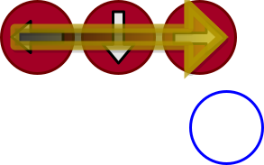 ⬅ ⬇ ➡ 

#### 6 → 2 → 4

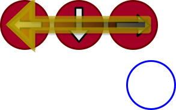 ➡ ⬇ ⬅ 

ボタンを傷めそうな気がするのが玉に瑕。まあ、ボタンは消耗品。壊れたら交換しよう（自己責任で）。

## 方向入力

ボタンの同時押しができるので、同じ方向を入力するのに複数のパターンが考えられる。
ボタンon/off の状態が 2、移動ボタンの種類が 4 なので、 $2^4 = 16$ 種類のパターンがある。それを網羅すると以下の通り。集合体恐怖症の人が見るには少しキツイかもしれない。

|   方向   |   入力   |
| ------- | ------- |
|  N (5)  | 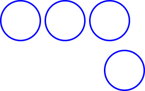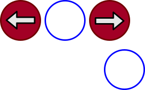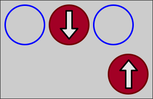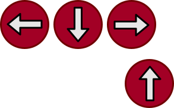 |
| ⬇ (2) |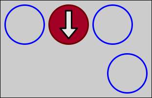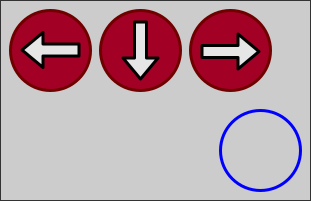 |
| ➡ (6) |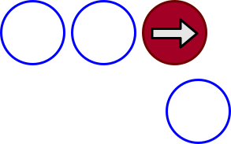 |
| ⬆ (8) |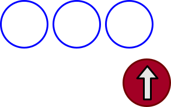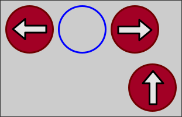 |
| ⬅ (4) |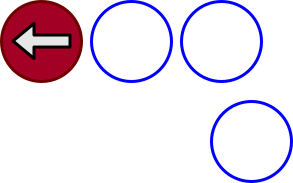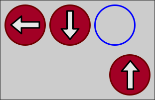 |
| ↙ (1) |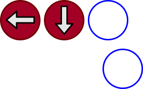 |
| ↘ (3) |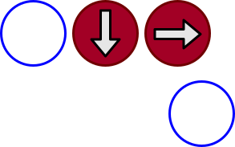 |
| ↗ (9) |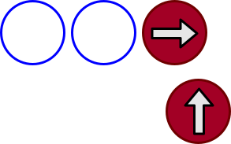 |
| ↖ (7) |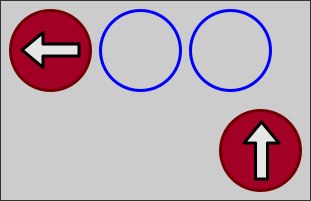 |

## ステップ

N → 6 → N → 6

ニュートラルから 6 を押さないとステップは成立しない。コマンド入力猶予は 8F

入力猶予を調べても分からなかったので検証した結果

（キーディスは下が過去）
| key  | 結果  |
| ---- | ---- |
| x ➡ 8 N 8 ➡ | 成立 |
| x ➡ 9 N 1 ➡ | 不成立 |
| x ➡ 4 N 9 ➡ | 不成立 |

特にしゃがみ状態から入力しようとすると、最初の N 入力が抜けやすい。

後ろステップも同様に N に入れる必要がある。

### 根性入力

 
 
 
 

同じ指で二回押す・ピアノ打ち等、
各自やりやすいと思う方法を見つけてください。 

### 逆方向入力ステップ

逆方向への入力でニュートラル状態を作る方法。

ニュートラルから 
 
 
 

前後にフラフラ歩きながらでも出しやすい。
しゃがみからだと、ピアノ打ちで根性入力した方が速いかなぁと言う感じ。

### 歩きながらステップ

前歩き中 
 
 
 
 

前に歩きながら前ステップしたい場合、逆方向を加えてニュートラル状態を作ると速い。
感覚としては、歩きながらそのまま 4 を二回弾く。
一見、普通に根性入力の方が速そうだが、6 を離してまた押すという運指は割と時間が掛かる。

## ドライブラッシュ

パリィ状態から前ステででる緑がかったやつ。 
パリィ状態にならなくても、ステップの二回目の前入力と同時にパリィを押せば、最速でドライブラッシュが出る。

どの段階でパリィボタンを押してもドライブラッシュになるが、途中で離したりして二回目の ➡ 入力時にパリィ押下状態でないと、パリィ終了の硬直モーションに移行して、ドライブラッシュが発生しない。
つまり、パリィはちょっと押しっぱなしにする感覚の方が安定します。しかしながら、パリィを少し押し続けるということは、ゲージ消費が微量ながら増えるということでも有ります。 
最速ドライブラッシュばかりやっていると、逆にパリイ状態から前ステップでドライブラッシュが出せることを忘れる（忘れてた）。

### 根性入力

 
 
 
 

ピアノ打ちでパリィのタイミングを最後に合わせるのは難しい。

### 逆方向入力ドライブラッシュ

 
 
 
 

## キャンセルドライブラッシュ

キャンセル可能な技を当てて、ヒットストップが終わる前に前ステップを入れるとパリィを押さなくてもドライブラッシュが成立する。
攻撃を出した後、ニュートラルに入れる必要があるのは、普通のステップと同じ。
したがって、特にしゃがみ技からキャンセルで出すのは、なかなか入力が難しいと評判だったが、2023/07/24 のアップデートで、(N or ➡) + 中P + 中K でも成立することになった。
前ステップが不要なので、立ち状態からであれば特に苦もなく出せるだろう。
しゃがみからなら、

 キャンセル可能攻撃 
 + パリィ入力 
⬇ を離してからパリィか

 キャンセル可能攻撃 
 + パリィ入力 

で出せる。

ラッシュ後に採りたい行動を考えると、⬇を離す方がスムースな運指が出来ると思うが、アップデートが来たら試してみたい。

## 電刃練気（⬇⬇+攻撃）

これもやはり N 開始で 2 の間に N を挟む必要がある。 
レバーだと出しにくいと思ってたけど、レバーレスだとステップと変わらない感じ。

### 根性入力

 
 
 
+攻撃ボタン 

ステップと違って攻撃ボタンを押さないと行けないが、ピアノ打ちでタイミングを合わせるのはちょっと難しい。

### 上押し入力

ジャンプボタンを離してから攻撃ボタンを押す必要がある。

 
 
 
+攻撃ボタン 

### しゃがみ状態から上押し入力

しゃがみ状態からだと、一旦ニュートラルにするため最初に⬆入力が必要になる。 
二回ジャンプボタンを弾いたあとで攻撃ボタン押下する。

 しゃがみ状態 
 
 
 
+攻撃ボタン 

## 波動拳

波動拳は、難しいコマンドではないが、方向コマンドの一部を省略しても出るとか、前要素なら ok という様な寛容さはないので、各方向にキチンと入力しないと成立しない。
但し、許容フレーム内(12F)でコマンドが成立してさえいれば、他の方向に入ってしまうのは ok。

### 根性入力
⬇↘➡ を素直に入力する。

 
 
 +攻撃ボタン

2P 側での入力や竜巻コマンドは逆方向になるだけで、要領は同じだが、横入力の指が人差し指と薬指で違うので、左向きの四半回転（薬指を使う）の方が若干難しいと思う。

これでも難なく入力できると思うが、慌てると（2 6 同時押し）をスキップしてしまうことが多い。
これは「離す」操作が速すぎる、という失敗である事が多い。 
あと、攻撃ボタン入力を早めに入力してしまってコマンド不成立という失敗も、この波動拳に限らずよくある。攻撃ボタンはズレるなら後ろにずらした方が良い。或いはピアノ打ちで保険を掛ける（OD暴発には注意）。攻撃ボタンを離すときにも必殺技が成立する様に設定しておく、等の対策もできる。

### 離す入力

 
 
 +攻撃ボタン

直感的ではないし、離す動きが連なる運指を速く正確に行うのは難しい。
最初の同時押しがズレて 6 を先に入力してしまうと、昇龍拳に化けるし。
三つのボタン同時押しを常に完璧に出来るように修練を積む？そこまでの優れた入力方法とも思えない。
離す運指練習には良いが・・という第一印象。

ただ、しゃがみガード中の様な、2+4 押している状態からの根性入力は、⬇が抜けたりしやすいので、こちらの入力を選択するのもアリと思う。 
しゃがみガードから根性入力する場合、まず 4 を離すが、対して離し入力だと先に 6 を押して（押しっぱなし）4, 2 と順に離していくので、こちらの方がやり易く感じる。 
4 または 2 + 4 を押した状態からの流れで入力する場合に限れば、入力しやすさ感も向上するので選択肢に入れても良いのかもしれない。 
特に、しゃがみガードから竜巻（後ろ方向に回す）を出す場合、根性入力よりはこちらの方が出しやすいかもしれない。

### 上押し入力

 
 
 +攻撃ボタン

押すだけ（離す操作がない）なので入力速度を高めやすいのが最大の利点。 
コマンド入力だけの場合（やっぱ撃つのヤメ、仕込み etc）、2 を先に離してしまうと、当然ジャンプするので、まず 8 から離すクセを付ける事。
咄嗟にやるとジャンプしてしまうこと多々あり。

2P 側で入力（或いは竜巻）の場合

 
 
 +攻撃ボタン

となって、ちょっと練習しないと入力しづらかった。
後述の最速キャノンストライクの入力で活躍する

### 前歩き波動拳

これはレバーレスに限ったことではないが、前入力から波動拳を撃とうとすると、昇龍拳に化けて困る。何故か？それを避けるにはどうすれば良いのか？

まず、波動拳と昇竜拳の入力が同時に成立していた場合、昇竜拳が優先して出るのが仕様。なので、それでも波動拳を出したいとなると、特別な操作を要する事になる。

<ol type="a">
 <li>真下入力から 8F 以上開けてから前要素か、前要素いれてから 8F 以上開けて攻撃ボタンを押す</li>
 <li>途中で後ろ方向に入力すると、昇龍拳コマンドに優先して波動拳を出せる</li>
</ol>

a. は昇龍拳が成立しないフレーム稼ぎをするという事。12F 空けてしまうと今度は波動拳も出ない。
例えばリュウの前歩きからしゃがみ中足キャンセル波動拳を撃ちたいケースを考えると、
➡ から ⬇入力と同時に中キックを押す。しゃがみ中足は発生 8F、持続 3F なので、8F 目で↘、9F 目で➡+パンチボタンを押せば、昇龍拳は成立しないので、10F 目でキャンセル波動拳を出せる。 
この文章の内容だけ見ると「無理っス」と思うが、実際やってみると、中足を当てればヒットストップが発生して（フレームメータが止まって、キーディスのカウントは進む）入力を遅らせつつ、キャンセルを間に合わせるのは、それほど難しくはない。

前歩きからそのまま波動拳を出す場合には、しゃがみを 8F 入れて↘➡と入力すれば昇龍拳が成立せず、波動拳が発生する。 
しゃがみで 8F 以上待ってから波動拳を撃てばいいということにはなるが、対戦相手はこの遅らせフレームを、戦隊モノの変身シーンに於ける怪人の様に待ってくれるのか？という問題が残る。しゃがみ状態への移行モーションがはっきり見えるフレーム数なので、波動拳を撃ちそうだと勘付かれる可能性も高い。

b. を採用する場合の注意としては、6 に入れる前に攻撃ボタンを押してしまうと、↘でコマンドが完成することになる。
この場合、波動拳コマンドが成立しておらず、昇龍拳コマンドが成立している（遅かったら不成立だが）。結果、昇龍拳が暴発する。
また、2 や 3 が入力されていない場合も、波動拳は成立しないので、昇龍拳が暴発することが多い。

あと、他に半回転コマンドを持っているキャラだとそちらの技が出てしまうかもしれない。
ダルシムだとヨガフレイムが出てしまう、と思ったが、ヨガフレイムは前から後に半回転させるようになっていた。

## キャノンストライク

空中で竜巻コマンドを入力する技。 
SF4 の頃は超低空で出せたり、垂直やバックジャンプからも出せたようだが、現時点では前ジャンプ中、一定の高さ以上でないと出ない仕様になっているとの事。

### 空中で入力

空中で竜巻コマンド（後ろ向き波動拳）
運指については、下の根性入力だけでなく、波動拳で紹介した入力パターンを利用できる。

 空中で 
 
 +攻撃ボタン

### 地上で入力

低空キャノンストライク。低い位置で出したい場合には、地上でコマンドを入れてからジャンプして、攻撃ボタンを押す。

地上で竜巻コマンドを根性入力してもいいが、最速でジャンプしたいので、上押しを活用する運指と相性が良い。

 地上で 
 
 
 + 上入力後 てから攻撃ボタン 

9 方向の入力は、8 を先に押してしまっても、4F 以内に 9 方向への入力があれば、前方向にジャンプするので、多少のズレは問題ない。 
よくある失敗は、8 を押す以前に 2 を離してしまう（後ろジャンプする）

| キーディス | 結果 備考等 |
| -------- | ---- |
| 8 ↗ 弱K 7 ↗ 1 ⬆ 3 ⬅ 4 ↙ 4 ⬇  | 成立 (2 + 1 + 7 + 1 = 11F) |
| 9 ↗ 弱K 6 ↗ 4 N 2 ⬅ 6 ↙ 5 ⬇  | 不成立 (1 + 4 + 6 + 1 = 12F) |
| 5 ↗ 弱K 1 ↗ 1 ⬅ 5 ↙ 3 ⬇  | 成立 (0 + 1 + 1 = 2F) ↗の1F後にキックで成立 |
| 7 ↗ 弱K 2 ➡ 2 ⬅ 6 ↙ 2 ⬇  | 不成立 (1 + 2 + 1 = 4F) ↗とキックが同時だと出ない？ |
| 11 ↗ 強K 7 ↗ 2 ➡ 1 N 1 ⬅ 7 ↙ 4 ⬇  | 成立 (0 + 1 + 2 + 7 + 1 = 11F) |
| 7 ↗ 強K 7 ↗ 3 ➡ 2 ⬅ 7 ↙ 4 ⬇  | 不成立 (1 + 3 + 7 + 1 = 12F) |

* 攻撃ボタンを押すまでの猶予は 後ろ入力から 11F 以内と思われる
* ジャンプ入力の 1F 以降でないと成立しない（同時だと不成立）。これが高さ制限？
* 強度によって許容フレームに差があるということはなさそう。

## ヨガフレイム

下半回転入力 ⬅↙⬇↘➡ の事です、と書こうとしたが、今のヨガフレイムは逆方向に入れるようだ。
昔はそれを逆ヨガと云ってた様な気もするが、今どう呼ばれるのか調べてみたら、[昔のまま](https://game.capcom.com/cfn/sfv/column-130284.html)だった。 
逆ヨガの方が入力する機会が多そうなので、ここでは逆ヨガ➡↘⬇↙⬅について説明する。

仕様としては、

(6, 3) (3, 2, 1) (4) この括弧からそれぞれ最低一つは入力があり、なおかつ重複しない方向が 4 つ以上順番に入力された以降で攻撃ボタンを押すのがコマンド成立の条件の様です。

➡ ⬇ ⬅+攻撃ボタンでも成立していた時期もあったようだが、スライド入力で試してみたが現在(2023/07)はコマンド成立しない。

方向ボタン入力のパターンをすべて網羅すると、かなり多くなるので、入力シーケンスを考える際の参考資料的なものを記述します。

### 6 開始ヨガフレイム

6 開始だと四通りの入力方法が考えられる。 
6 - 3 - 2 - 4, 6 - 3 - 1 - 4, 6 - 2 - 1 - 4, 6 - 3 - 2 - 1 - 4

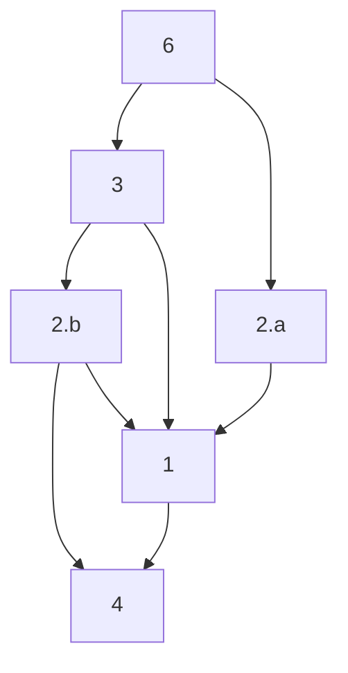

上のルートを、下の運指を参考にやりやすい押し方を探しながら辿ってみてください。 
「根性入力でええわ・・」という気もしますが、一覧の後でやりやすいと思った運指を一つだけ紹介してます。

#### 6

 

### 3


### 2.a

### 2.b

### 1


### 4


6右側は、しゃがみ状態から入力する場合に選択肢としてもいいかなと思う。 
これは難しいだろうと思うのは、「3 → 1」「6右側 → 2.a右側」「2.b右側 → 4真ん中」のパターン

可能性を感じるのは、「6左側 → 3左側 → 2右側 → 4 右側」のパターン。

 
 
 
+攻撃ボタン

ほぼ根性入力だが、この意識で入力すれば、4 入力時の同時離しがずれても（1 または N になるだけなので）コマンドは成立する。うまく行けばコマンド一個分お得。 
よくある失敗は、2, 4 両方を離す前に攻撃ボタンを押してしまう事。

### 3 開始ヨガフレイム

コマンド順は 3 → 2 → 1 → 4 となる。
しゃがみから入力するのであれば、こちらの方がやりやすいと思う。

 
 
 
+攻撃ボタン 

次に、上押し波動拳入力を利用する方法。入力速度は高めやすい。

 
 
 
+攻撃ボタン 

最後に、しゃがみガードからの波動拳（2P側）離し入力が得意ならそれでもok

 
 
 
+攻撃ボタン 

## 昇龍拳

### 昇龍拳コマンドについて

(3, 6, 9) → (1, 2, 3) → (3, 6, 9) この括弧の中からそれぞれ一つの方向を、この順番に 7F 以内に入力する。 
ただし、同じ方向を連続して入力した場合には成立しない（3 → N → 3 など他の方向を挟んで 7F 以内に入力したら成立する模様。正確性・高速性ともに難しい）。 
三番目の入力以降の 7F 以内に攻撃ボタンを押せばコマンド成立。

対空技として使う場合には、しゃがみ状態から出すことで、コマンド入力中の当たり判定を下に寄せることが出来、相手のジャンプ攻撃が当たるタイミングを遅らせられ、引き付けてから撃ちやすい為、しゃがみ状態を維持できる入力が重宝されている。 
被当たり判定を気にしなくて良いコンボへの組み込み等の場合は、運指を滑らかに繋げる為のパターンを選択すれば良い。 
もちろん、決めた一つの運指に絞って使うのも自由。

昇龍拳キャンセルからの SA コマンド（前方向四半回転x2）に繋げる場合、⬇↘を経由している入力であれば、コマンド入力を流用しやすい（➡⬇➡を足せばいいだけになる）。

### 根性入力

 
 
 +攻撃ボタン

### 簡単

➡↘➡ 入力。
入力は楽だが、コマンド成立直前が立ち状態なので、対空の際には問題が起きるかもしれない。

 
 
 +攻撃ボタン

コンボ途中なんかはこれで良いかも。ただしキャンセル SA に繋げる場合には、⬇に入ってない為コマンドの流用は出来ない。

### ジャンプ押

 
 
 +攻撃ボタン

入力自体は ➡↘➡ 昇龍拳
⬆入力は右手親指にしてもやりやすい。 
押すのみだから高速入力しやすい（3F入力も現実的）が、コマンド成立直前の状態が立ち状態。ジャンプ漏れ注意。

### しゃがみ維持

↘⬇↘ 入力。 
しゃがみ姿勢を維持できる為、引き付けて撃てるベスト昇龍拳入力。これを一番練習するのが良い。
コンボに組み込む時は、こっちでも良いが、どちらかというと簡単入力がいいのかなと思う。
キャンセル SA コマンドに流用する場合もこちらの方が優秀。

#### その1

 
 
 +攻撃ボタン

#### その2
 
 
 +攻撃ボタン

一見、その1 の方がやりやすそうに見えるが、6 を二回押すという動きを指一本でやろうとすると、10F 位掛かってしまうことが多い。その2 で 4 を弾き入力すれば 5F~9F 位なので、その 2 の方が優秀と思う。各自、速さだけではなくて良いと思う方を試してみてください。

### その他

昇龍拳は他にも様々な入力方法が考えられるので、どれもしっくりこないなぁ、という方は、自分で模索してみてください。

## 真空波動拳

四半回転 x2 + 攻撃ボタンコマンド。キャラによっては前向き・後向きそれぞれ設定されていたりする。

### 根性入力 

 
 
 
 
 
 +攻撃ボタン

### 斜め省略入力

二番目または五番目の ↘ 入力は、どちらかを省略できる。

波動拳は 3 がスキップされると成立しないが、真空波動拳は四半回転二回の内一回は 3 を省略しても成立する。
つまり、23626 か 26236 で良い。

23626 の方は、波動拳・昇龍拳((6|3)23)入力の必殺技キャンセルから出しやすい。そうでなければ 3 を後半に置いてもいいと思う。

ちなみに、昔(SF5)は ⬇➡⬇➡ でも良かったらしい。

 
 
 
 
 +攻撃ボタン

最後の同時離しがズレた場合、4 を先に離すと↘、2 を先に離すと N なので、コマンド成立上問題とならない寛容さ。

### 上入力式

上入力波動拳の派生型

 
 
 
 
 +攻撃ボタン

または

 
 
 
（ここまでは同じ） 
 +攻撃ボタン

一見下の方がやりやすそうだが、「2押維持+6離+8離 → 2離+6押」という運指の難易度は高い。
ジャンプを離すより先に下を離してしまって、ジャンプが漏れる、下を離すのが遅れて前下入力時に攻撃ボタンを押してしまってコマンド不成立、あるいは SA じゃない通常必殺技が暴発する、などの罠も多い。
離す操作が一つで済む上の方が初心者向けだと思う。
レバーレスに慣れて、離す操作が熟れて来たら、また意見が変わるかもしれない。

### 必殺技キャンセルSA

SA2 は OD 必殺技をキャンセルできる。
SA3 は必殺技をキャンセル出来る。（が、OD必殺技はキャンセルできない？） 
キャンセルできない必殺技もある。トレモでキャンセルタイミングの表示を ON にして、必殺技を当てたときにキャラが青くなったらキャンセル可能。
ここでいう SA コマンドは前方向への四半回転を二回入力するタイプのものを念頭に置いている。

とはいえ、必殺技のヒットストップ中までに長い SA コマンドを入れるのは大変です。「出来るか！こんなもん！！」と思ってました。前の必殺技のコマンド入力を SA コマンドに流用できると知るまでは。

どういうことかというと、ケンの迅雷脚(236)キャンセル神龍裂破(236236)の様なコンボは、前項で説明した 3 省略入力を利用すると、

 
 
+キック 
 
 +パンチ 
神龍裂波の前半の四半回転として迅雷脚のコマンドを流用できて、この様に入力すれば出るということ。 
四半回転と⬇➡は、各自やりやすい方法でどうぞ。

### 昇龍拳キャンセルSA

昇龍拳の入力方向は沢山あるが、SA コマンド流用を考慮するなら、⬇↘を通る入力を採用する必要がある。つまり 636 や 626 昇龍拳だと、SA コマンドの一部を構成できない。

 
 
 +攻撃ボタン（昇竜拳用） 
 
 
 +攻撃ボタン（SA用） 

昇竜コマンドと ➡⬇➡ はやりやすい方法を試してみてください。

## 溜め技

レバーレス導入初期に操作に慣れるキャラとして、溜めキャラのほうが扱いやすいと言われている。私は「とりあえず昇龍拳だせるかな？」とコマンドキャラを試しましたが。

レバーレスの強みの一つ、「反対方向への入力が速い」という長所を活かせる。 
レバーだと、前から後に入れようとすると、6 → N → 4 と最速でも 2F 掛かるのに対して、
レバーレスだと、６ → ６離+４押 が最速であれば 1F で出来る。
何れも最速で操作するのは難しいが、溜め開放後、溜め方向に素早く入れなおしやすい。 
上下 SOCD が⬆だった頃には 1F で発動、1F で溜め開始という様な事がやりやすかったが、現在では不可能ではないとはいえ、難しくなった。

攻撃ボタンを押すタイミングは、溜め開放したフレームから数えて一定フレーム以内に、方向ボタン+攻撃ボタンを押す必要がある。 
規定フレーム数以内であれば、攻撃ボタンを押すフレームで、方向ボタンが押されていなくても成立する。つまり、攻撃ボタンを押す前に、次の溜め技を溜め始めるという事は可能。

### 溜め時間

調べた。キーディスを見て以下より 1F 短いフレームだと成立しないことを確認。

| 必殺技 | フレーム数 |
| ------- | ------- |
| ソニックブーム | 45 |
| サマーソルト | 45 |
| スーパー頭突き | 40 |
| スーパー百官落とし | 40 |
| ローリングアタック | 40 |
| バーチカルローリング | 40 |
| エリアルローリング | 40 |
| 気功拳 | 50 |
| スピニングバードキック | 30 |
| エアスラッシャー | 45 |
| ジャックナイフマキシマム | 40 |

上記フレーム数の溜め開放から 9F（全ての技について調べたわけではない）以内に方向+攻撃ボタンで成立する。

| フレーム数 | 時間(ms) | テンポ(bpm) |
| -------- | ------- | -------- |
| 30 | 500.0 | 120 |
| 40 | 666.67 | 90 |
| 45 | 750.0 | 80 |
| 50 | 833.33 | 72 |

メトロノームでテンポを合わてクリック音を聞けば、その溜め時間の感覚を養える（かもしれない）。

### 横溜め

↙に溜めたまま横溜めコマンドを入力しようと↘に入れてもコマンドは成立しない。例えばガイルで、↙で溜めて↘+パンチボタンを入力してもソニックブームは撃てないという事。↘を➡にすれば成立する。 
また、コマンドの前方向のつもりで↗に入れた場合、同時に攻撃ボタンを押しても必殺技が成立せずにジャンプしてしまう。 
この事から、横溜め技コマンドの➡は「前要素+攻撃ボタン」ではなく、厳密に「➡ + 攻撃ボタン」が要件と思われる。 

 溜め 
 溜め開放（⬅以外は押下状態でも良い） 
 +攻撃ボタン 

* 溜め開放フレームで ➡+攻撃ボタンを押せれば 1F で発動出来る。
* ➡ に入力したフレーム以降かつ、溜め開放フレームから一定フレーム以内（ほとんど 9F）に攻撃ボタンを押せば成立する。

### 空中横溜め技

ブランカのエリアルローリング（溜め 40F）は、バックジャンプからなら自然に出せるが、垂直ジャンプや前ジャンプはブランカの場合それ自体全体 45F で終わる。ジャンプ後 1F で溜め始める神業をマスター出来ても、溜まり切るのは着地寸前。 
低空キャノンストライクの要領であれば、バックジャンプ以外からでも出せる。 
コマンドの溜め部分を地上で済ませて、溜め開放と同時にジャンプして、溜め開放から 9F 以内に ➡ + パンチボタンで成立させれば良いという方針。

#### 垂直ジャンプからエリアル

しゃがみガードの場合。⬅のみでもok 
 
 +パンチボタン 

⬆は弾き入力等でできるだけ早く離したいところ。右手親指で押すのも良いかもしれない。 
⬆を押してから 4F 以内に➡を押してしまうと、前ジャンプとして扱われる。違いが分かるかどうかはさておき、垂直じゃないと困る場合は注意。ジャンプ方向で裏表択が出来たりするかもしれない。知らんけど。

#### 前ジャンプからエリアル

しゃがみガードの場合。⬅のみでもok 
 ジャンプボタンを弾き入力 
 +パンチボタン 

⬆は弾き入力等でできるだけ早く離したいところ。右手親指で押すのも良いかもしれない。 

#### もっと低空でエリアル

地上で➡入力まで済ませてジャンプ前に方向コマンドを完成させておくと、早めに出しやすい。

 しゃがみガードの場合。⬅のみでもok 
 垂直ジャンプしたければ素早く離す 
 +パンチボタン（➡入力から 9F 以内かつジャンプ後 1F 以上） 

パンチボタンがジャンプボタンと同時だと、ご想像の通り普通のローリングアタックが発生する。
 

### 下溜め

下溜め技の場合、⬇要素(1, 2, 3) に一定時間溜めてから、⬆要素(7, 8, 9)+攻撃ボタンで成立する。
⬅に溜めたままでもコマンドを成立させることが出来るという事になる。

しゃがみ状態。⬅➡押しててもok 
溜め開放 
 +攻撃ボタン  ⬅➡押しててもok 

* 溜め開放フレームで ⬆+攻撃ボタンを押せれば 1F で発動出来る。
* ⬆要素 + 攻撃ボタンは、溜め開放フレームから 9F 以内に完成しないと成立しない。
* ⬆要素入力から攻撃ボタン押下の猶予は 0F~4F でないと、ジャンプ通常攻撃が発動する。

#### しゃがんだまま発動

⬆を押して発動する必殺技となるので、発動の瞬間は立ち状態とになる。しゃがみ昇龍拳で説明したように、しゃがんだまま必殺技を出せたほうが対空などでは有利となる事が多い。
溜めキャラでしゃがみ必殺技対空は諦めないといけないのか、というと一応手段は残されている。

ストリートファイターシリーズでは、通常技発生直後の 1F で必殺技コマンドが成立した場合、通常技をキャンセルして成立した必殺技が発動する（コンボ等に使う通常技を当てたときのキャンセル必殺技とは別のメカニズムで発生する）。この仕組みを利用する。 
しゃがみ通常技を出して、その発生 1F 目で必殺技コマンドを完成させれば、しゃがんだまま出せる。という理屈。

難易度は高いです。

溜める 
+通常攻撃（しゃがみ攻撃） 
 (1F) +攻撃ボタン（本命必殺技用） 

しゃがみ通常攻撃に使う技はなんでも良いが、
<ol type="a">
  <li>同系統攻撃（パンチ・キック）を使うと、OD必殺技が出る（OD必殺技は同時押しが 1F ズレても成立する）</li>
  <li>別系統で弱強度の攻撃を使うと、投げになってしまう（投げは同時押しが 1F ズレても成立する）</li>
  <li>しゃがみ攻撃なのに立ち状態と変わらない姿勢の技だと意味がない</li>
</ol>

等の注意が必要。 
a. について、OD必殺技でよければ問題ありません。 
b. について、春麗で弱SBK と投げ、どちらが優先されるか試した所、ジャンプ投げ（失敗）が出ました。中・強についてはパリィ、DI より必殺技が優先されました。 
c. について、1F 目の姿勢を確認しておきましょう。

成功時のキーディスはこんな感じ（春麗の弱SBKで試行、通常技としてしゃがみ中P）

1 ⬆ 弱K 
2 ⬆ 中P, 弱K 
1 ⬇ 中P 
80 ⬇ 

## スクリュー（一回転）

スクリューは、⬅ ⬇ ➡ が正確に入っており、上要素は↖ ⬆ ↗いずれかが入っていれば成立するという仕様。 
上方向以外に関しては斜めが入っても失敗にはならないが、コマンドとしては認識されない。
各方向に入ってさえいれば、順番はどうでもいい。
⬅ ➡ ⬇ ⬆+攻撃ボタン でも出せる。

以下順不同 
 
 
 
 or
 or

 
+最後に攻撃ボタン

⬆方向の入力はジャンプしてしまうので、地上で技を出すにはどうすればよいのかという問題がある。
その処理方法が、
* ジャンプ着地寸前で⬆入力する。或いは着地寸前までに回転部分の入力を完成させてしまう。
* 技発生、ガード、ステップ中などの硬直時間中に⬆入力する
* ⬆入力後、ジャンプが発生するまでに攻撃ボタンを押すことで必殺技を発生させてしまう（立ちスクリュー）

立ちスクリューは、システム的に 上を押しても、一定フレーム数以内に必殺技発生ボタンを押すと、必殺技入力が優先される事を利用する（そのフレーム数は技による？）。 
少なくともスクリューパイルドライバーは、上入力から 5F 以内にパンチボタンを押せば、ジャンプをキャンセルしてスクリューが出る。 

キーディス例を挙げると（下が過去） 
3 ⬆ P  => スクリュー成立 
5 ⬆ 
3 ➡ 
4 ⬇ 
4 ⬅ 
こんな感じでも成立するということ。

スクリューが失敗する（間合いに入ってるのに、おっとっとっモーションが出る）もう一つ分かりにくい原因としては、相手がダメージ喰らい中やガード硬直中に投げ判定が発生してしまう場合。この場合スクリューに限らず投げは成立しない。

### ボルシチダイナマイト

ボルシチダイナマイト（空中で一回転+キック）については、上入力と同時にキックボタンをおしても成立する（キャノンストライクだとダメなのに）し、なんと 20F 後にキックボタンを押しても成立する（21F 後だとジャンプキックが出て失敗）。ザンギエフのジャンプの全体フレームは 46F なので、ジャンプ頂点の少し手前まで地上でのスクリューコマンド入力が間に合う事になる。 
つまり、ボルシチダイナマイトの攻撃ボタン受付猶予は 0F~20F なので、ジャンプ登り中に出したければ、地上で入力するのが楽だと思う。

 
 
（方向の順番は適当に） 
 + 0~20F内でキックボタン（横方向は省略）

頂点付近で出したければ、ジャンプ入力後 20F のギリギリを狙うよりは⬆を押してから、のんびり 20F 位掛けて残り三方向を入力するのが良いと思う。

 （横方向は省略） 
 
 
 + キックボタン（方向の順番は適当に） 

ジャンプ降下中にボルシチなら、空中で一回転根性入力する事になる。

 （横方向は省略） 
 
 
 
 + キックボタン（方向の順番は適当に）

### 硬直時間利用

技を出したりガードしたりした時の硬直時間に ⬆ を入力しておけば後は ⬅ ➡ ⬇ を入力すれば良い。
ジャンプ着地寸前で⬆入力するのも確実性が高いし、あまり練習せずとも出せると思う。
失敗する場合、⬇ がスキップされていることが多い。

### 立ちスクリュー

コマンド入力の最後で上を入れると同時に攻撃ボタンをおして、技のコマンドを完成させてしまう事で、ジャンプ暴発を回避する。 
上ボタン押下からジャンプ移行までの 5F 以内にパンチを押せばスクリューが成立する。
いわゆる立ちスクリューコマンド

 
 
 
+攻撃ボタン 
または 
 
 
 
+攻撃ボタン 

⬆ 方向以外はそれぞれ独立した入力が最低 1F 必須

方向入力は順不同なので、例えば ➡ ⬅（ウロウロしてもいい）から⬇⬆+攻撃ボタンでも出る（間隔が12F以内であれば）。

### スライド入力

スライド入力は各方向ボタンを独立して、しかも高速に押しやすいので、スクリュー入力と相性が良い。
426 または 624 をスライド入力した直後に 8+攻撃ボタンで、コマンドが成立する。

 
+攻撃ボタン 

又は 
 
+攻撃ボタン 

### 上入力からの立ちスクリュー

スライド入力なら、上入力スタートの立ちスクリュー入力が現実味を帯びてくる。
前述の通り、スクリューは上入力から 5F 以内に攻撃ボタンを押せば成立する。これを利用すれば上入力後、スクリュー成立に必要なのは「⬅, ⬇, ➡ + 攻撃ボタン」だから、3F あれば良い。まだ 2F も余裕あるやんか。という理屈。 

 
+攻撃ボタン（6入力時） 

逆も同様

 
+攻撃ボタン（4入力時） 

難しいけど、立ちボリショイをやるためには必須テクニック。 
まず、⬆ボタン入力を 1F で離すつもりで入力しないといけない（右手親指で入力するのが良いと思う）。ここに 3F も掛かってしまっては難しい。 
次にスライドのスピード、移動ボタンが 24mm径なら、⬅ から ➡ までの 約6cm 位のスライドを 3F(50ms) で行うには、秒速 1.2m で動かす事になる。 
パンチボタンを押すタイミングも 1~3F の間（3Fはそれ以前の入力に全く無駄が無かった場合のみ）に入力しなければならない。

文章では分かりにくいが、成功したときのキーディスを見た方が分かりやすいかもしれない。

キーディス（過去が下）
| Key | フレーム数 |
| -------- | ---- |
| 1 ➡ P 1 ⬇ 1 ⬅ 1 ⬆  | 3F（理想。試行中は出なかった） |
| 1 ➡ P 1 ⬇ 2 ⬅ 1 ⬆  | 4F |
| 2 ➡ P 1 ➡ 1 ⬇ 1 ⬅ 1 ↖ 1 ⬆ | 5F |
| 2 ➡ P 1 ⬇ 2 ⬅ 2 ⬆ | 5F |

とりあえず最初は、トレモのゲームスピードを 50% に設定して感覚を掴むのが良いと思います。 
左向きにスライドしてもいいですが、立ちボリショイでは右向きスライドを 5F 入力とする方が良いかなと思うので、右向きで試行しました。
これを練習すると、小技やステップ等、ちょっとした硬直時間を利用して ⬆ 入力するのであれば、5F の制約はなくなりますから、スクリュー入力に余裕・自信が持てますので、5F 入力が常用レベルに到達しなくても役には立つと思います。 
これは極める系の技術ですから、5F スクリューが出来ないからザンギ使うのを諦めよう、等と悲嘆に暮れないで下さい。

## ボリショイストームバスター（二回転）

スクリューと同じように ⬅ ⬇ ➡ は正確に入ってる必要がある
その上で、一回転+三方向を入力して攻撃ボタンを押せば成立する。許容フレーム数はよくわからない。 
二回転コマンドとは言え、実質的には 270° + 270° = 540° と考えるのが一番わかり易い。
とはいえ一回は途中で⬆入力が必要になるので、スクリュー以上にジャンプ回避のための処理が厄介になる。

検証中 分かっていること: 
攻撃ボタンの猶予フレーム数: 12F までは成立する事を確認 
方向入力の猶予フレーム数: 8F までは確認、9F で不成立？ 
   10F でも出るときが有る。なんでだ？ 
なんか、コマンド入力の全体フレーム数に制限があるんだろうか？全体的に長めだと不成立な気がする。

### ジャンプ着地でボリショイ

要領としてはスクリューと同じだが、入力数が増えるので少し難しい。
ジャンプ着地前にボリショイコマンドを入力して、着地時にパンチボタンを押せばいいだけ。
コツは、どの方向（指）からコマンド入力を始めるのか、どの順番でボタンを押すのか、どれくらい時間が掛かるのか、トレモで確認しながら、自分がやりやすい方法を決めておく事。 
ちなみに私は 42684268 と決めてます。最後は 8 ではなく 6 のところでパンチボタンを押しても成立するのですが、8 を入れておくと偶に方向が一個抜けていても成立する場合が有るので、保険を掛けているつもりです。
どういう入力が出しやすいかは人それぞれですので、ご自身で試行錯誤してみてください。

### 硬直中に上入力でボリショイ

前ステや技を当てたりガード中など上を押してもジャンプしない状況で、⬆入力を済ませる入力方法。 
例えば、立ち小キックは全体硬直が 25F なので、その間に⬆を入力してジャンプ移行を避ければそのままコマンドを繋げられます。 
とはいえ、⬆入力の為だけに 24F も費やすのは勿体ないので、⬆を入力する*前に* 4, 2, 6 を入力してしまいましょう。少し練習すれば、ここまで入力してもまだ 24F も使ってない事が多いでしょう。4, 2, 6, 8 の入力は、ザンギ使いならいつもやっている事ですね。
8 を押していますが、硬直中なのでジャンプには移行しません。
いつものスクリュー 8 を押したこの瞬間にパンチボタンを押しますが、今はボリショイを出したいので、ここでパンチを押す代わりに残りの三方向入力に繋げます。
もう ⬆ 入力は要りません。そのまま 4, 2, 6 を入力すれば、後はパンチボタンを押すだけで「フルパワーでや！」の雄叫びが聞けることでしょう。 
6 の次に 8 を入力してからパンチボタンを入力したほうが安定する気がするので、そう思う方は保険を掛けておく意味で 8 まで入力するのもオススメです。 
これでも（キーディス見ても全部足りてるのに）出ない場合、全体の入力時間をもう少し短くしてみてください。具体的に何フレーム以内で、という数字を提示したいところですが、今のところよくわかりませんでした。

以上をまとめると、この様な運指になると思います。

+立ち小キック etc 
 
 
 
 小技などの硬直が終わる前に上は離す 
 
+パンチボタン 

4, 2, 6 は 6, 2, 4 でも構いません。前半後半の三方向は何れも各方向に入ってさえいれば、順不同で構わないと思います（全部試したわけじゃないので多分）。

最後に⬆を入れるなら、最後はこうなります 
 
+パンチボタン 

### スライド入力でボリショイ

硬直中の入力でスライド入力を併用する事もできます。

 前入力状態。硬直状態 
 
 
+攻撃ボタン（6入力時に） 

前ステなど、前入力状態からボリショイを出したい場合にはこれがやりやすいと思います。

### 立ちボリショイ

小技やガード等の硬直時間を利用しないでボリショイを出すには、
⬆入力から 5F 以内にコマンドが完成すれば、ジャンプはキャンセルされて必殺技が発動する仕様を利用する。

コマンドとしては、前節のスライド入力併用硬直ジャンプ入力と同じです

 
 ここから 5F 以内コマンドを完成させる 
+攻撃ボタン（6入力時に） 

レバーやパッドだと出来る気がしない（超人は除く）が、レバーレスなら常人でもスライド入力すれば 5F に間に合わせる事は出来る（簡単だとは云ってない）。
左方向へのスライドは人差し指で行って、8 を押したらその人差し指で右方向にスライドする、という入力方法が良いかなと思いますが、やりやすい方法は人それぞれだと思います。
8 は右手親指で押すのが良いと思う。左手だけで入力したければ、左方向スライドに左手薬指を使うなどすると良いかもしれません。
⬆を押した瞬間から最速入力できたとしても 3F は掛かるので、2F しか猶予はない。
上入力に 2F 掛かってしまったとしたら、1F しか余裕はない。

練習の仕方は、まず⬆入力以降で 5F 以内の立ちスクリューを練習する。
これが出来たら、ここより前の左スライド入力と上入力を 12F 以内に繋げたら良い。
前半のスライド入力は 5F 以内に入力する必要はないので、後半よりは気楽。
とはいえ難しい。
上入力が 1F で完了出来る事が少なく、2F 使ってしまうことが多い
となると、後 1F しか猶予がない。

移動ボタンのサイズは 30mm の方が、ピアノ打ちがやりやすいし、誤操作も減りそうで良いのに、なんで 24mm なんだろう？と思っていましたが、このスライド入力を常用するのであれば、立ちボリショイの要件となる 5F(83.33ms)の間に、24mm 径で約 7cm 移動するのと、30mm 径で約 10cm 移動するのでは前者の方が簡単なので、移動ボタンのサイズも小さいのか、と納得しました。

## 運指の難しさ

指の動かしやすさに差がある事の意識付け、運指パターンを考える際、運指トレーニングの方針を検討する際に役立つかなとリスト化しました。
難しさは、入力の敏捷性・高速性・正確性が比較的低い、という意味で考えています。正直人によって感じ方は違うと思いますが。

* 押すより離す方が難しい
* 離す難しさというのは、次のコマンド入力のタイミングが掴みにくい事を含む
  * 同時に移動ボタンと攻撃ボタンを押すよりも、移動ボタン離+攻撃ボタン押の方が難しい
* 連続入力は、別のボタンを押すよりも、同じボタンを押す方が遅い
* 別のボタンを連続入力する時は、小指→人差し指方向よりも、人差し指→小指方向の方が難しい
* ３つ以上連続入力する場合、同一方向に連続するより、方向転換を含む方が難しい（例：426より462の方が難しい）
* ３つ以上連続入力する場合、押すだけ或いは離すだけよりも、押すと離すが混在していたほうが難しい
* 複数ボタン同時入力の場合、まとめて押す > まとめて離す > 押・離混在の順で難しくなる
* 指の動かしやすい順番： 人差し指、中指、親指、薬指、小指
* 親指は他の指と独立して動かしやすいが、薬指と同じくらい遅い
* 上ボタンと同時（或いは 1F ずらし）に攻撃ボタンを押す場合、左手親指で上を押すよりも、右手親指で押したほうが合わせやすい。
* 426 または 624 方向に斜めをスキップして入力する場合、それぞれ別の指で押す離すよりも、スライド入力のほうが簡単（少し練習すれば）
* 中指を跨いで交互に入力する場合(4->6, 6->4 etc)、指の付け根を動かすよりも、手を捻る（ロールさせる）方が簡単

# 練習パターン

* 対空迎撃練習
  * ウロウロしながら対空
  * めくり対空
* 中足払いキャンセル
  * 波動拳
  * ドライブダッシュ
    ドライブダッシュは、ニュートラルからじゃないと発動しないので、中K 押した直後に 2 離さないといけない。
    下方向が入ったままだと受付時間を無駄に経過するだけなので、素早く離す事を意識すれば出やすい
* しゃがみガードから
  * 波動拳
  * ダッシュ  2, 4 離 → 6 押 → 4 押 → 4 離 でも出るが、なんか遅い、しゃがみ離したらピアノ打ちが速い
  * 昇龍拳 2,4 押から始めるなら、4 離+6押 → 4 押 → 4 離 + 攻撃ボタンがしゃがみのまま撃てるが、運指は少し難しい。
    出ない時は、6 を離してしまっていること、4 離す前に攻撃ボタンが入っている事が多い

* ウロウロしながら
  要するに前移動しながら、後ろ移動しながら
  * 波動拳
          前歩きだと昇龍拳に化けないように昇竜入力をキャンセルできるタイミングで
* 前ステップから
  簡単ステップからとピアノ打ち、どちらも使う
  * 波動拳
          ピアノ打ちでステップするなら、中指→人差し指で弾かないと波動拳入力が遅れる
          前ステップは 19F(RYU)なので、前入力を離してから 9F 余裕をもたせて 2 押から 9F 以内で波動拳入力すれば、昇龍拳に化けずに最速で出せる
          ピアノ打ち以外はステップ入力の 6 を離した
  * 昇龍拳  しゃがみ昇竜なら 6 押 → 4 押 → 4 離 → 2 押 → 4 押 → 4 離+攻撃ボタン
           しゃがんでも、ステップは立ち姿勢なので最速で出なければ安全度高まるだけ。
           最速なら、6 押 → 4 押 → 4 離 → 2 押 → 2 離+攻撃ボタンでも良いが、前ステップが 19F なので、しゃがみでもそれ以内で入力すれば同じこと。
  * 前ダッシュ

# 辻式

同じボタンを 2 フレーム連続で入力すると、押しっぱなしと認識されるため、同一ボタンを 2 フレーム連続で入力することはできない。
しかし、強P を押して、かつそれを押したまま、中P を次のフレームで押すと、内部的には、中P 押しと同時に、強P の入力が成立している。
かつ、中P と 強P を同時押しすると、強P の優先度が高く、強パンチが出る事になる。
優先度については色んな仕様がある模様
つまり、物理的には不可能な 2F 連続で強P が入力されたと認識させることができ、目押しコンボなどの受付時間が 1F のシビアな入力に猶予ができる事になるという原理。

SF5 以降は、技の先行入力を受け付けるようになったらしく、目押しが要らなくなったようだが、入力方法としては使えることもありそう。
SF6 だと、Overdrive 版の必殺技が出る

# 1Fキャンセル

キャンセル技は、それぞれ決まった技の後で、戻りモーションをキャンセルして別の技を出すことだが、それとはちょっと違う。
必殺技コマンドが成立する前に攻撃ボタンを押してしまうと、コマンド不成立で通常攻撃が出るが、直後（1F後）に必殺技コマンドが成立すると、すでにモーションが始まっている通常技をキャンセルして必殺技コマンドが出る。
